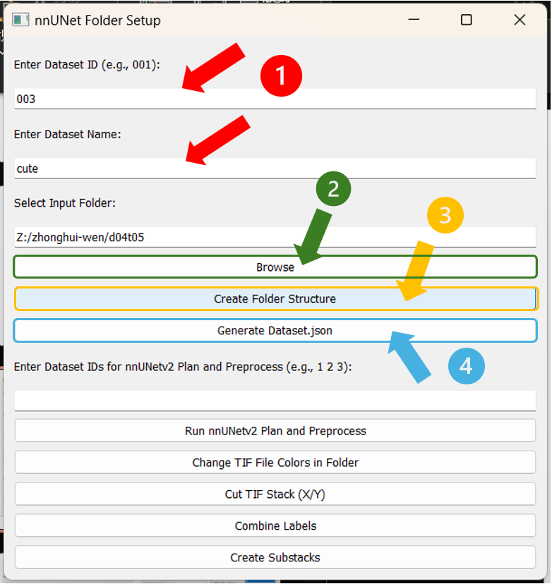

# nnUNetGUI

Make sure you already install PyQt5 and nnUNetv2 before you run this script.
The detials about how to use it please see the wiki instruction.
https://sitsel-wiki.oist.jp/books/nnunetv2-tutorial/page/how-to-use-nnunet-gui-for-simpliy-the-steps
OR check the PDF to see。

# How to use nnUNet_GUI for simpliy the steps

In order to make our use nnUNetv2 much easier, the lightweight GUI is made. 

Moreover, this GUI is also a useful tool for us dealing with tif file.

There are 5 main functions:  
- Folder structure created  
- Tif files color value changes  
- Tif file cut  
- Combine multiple Tif files with different labels into one Tif file  
- Create Tif file substacks

---

## For folder structure created

### Steps:

1. Run the GUI.  
   GitHub: https://github.com/guanzhongbudayinga/nnUNetGUI  
   See image 1

2. Enter Dataset ID and Name.  
   It will verify if the ID is a 3-digit number.  
   Note: if your input is not 3 digit-number it will pop up a window to remind you.  
   See image 2

3. Browse the folder that we will train.  
   Note: This original folder should include imagesTr and labelsTr. Make sure the folder names are correct.  
   See image 3

4. Click the **Create Folder Structure** button.  
   Note: It will show you a successful message.  
   See images 4 and 5. The default path is `Z:/zhonghui-wen/nnUNet_raw`

5. You could change it by yourself.

6. Click the **Generate Dataset.json** button.  
   Note: It will scan labels in labelsTr folder automatically.  
   If no labels are found it will show the message to you.  
   See image 6. If it finds labels it will pop up a window to let you give a name to the label.  
   Each label number is the specific label's value number. The background is always 0.  
   See images 7 and 8

7. Then the data folder structure will be directly created to your path.  
   Note: The default path I created is `Z:/zhonghui-wen/nnUNet_raw`, it will be fine if you change it to your bucket.  
   What you can do is find this path in the script and then change it to the path you wanted.  
   See code 1

---

(base) okwen@Intern-PC-1:~/Bucket/nnUnet_raw/Dataset003_cute$ tree
.
├── dataset.json
├── imagesTr
│   ├── ci_114_1_124.json
│   ├── ci_114_1_124_0000.tif
│   ├── ci_114_3_124.json
│   ├── ci_114_3_124_0000.tif
│   ├── ci_114_4_124.json
│   ├── ci_114_4_124_0000.tif
│   ├── ci_78_1_90.json
│   ├── ci_78_1_90_0000.tif
│   ├── ci_78_3_90.json
│   ├── ci_78_3_90_0000.tif
│   ├── ci_78_4_90.json
│   └── ci_78_4_90_0000.tif
├── imagesTs
└── labelsTr
├── ci_114_1_124.json
├── ci_114_1_124.tif
├── ci_114_3_124.json
├── ci_114_3_124.tif
├── ci_114_4_124.json
├── ci_114_4_124.tif
├── ci_78_1_90.json
├── ci_78_1_90.tif
├── ci_78_3_90.json
├── ci_78_3_90.tif
├── ci_78_4_90.json
└── ci_78_4_90.tif

---

## For color value change

### Steps:

1. Run the GUI  
2. Click the **Change colors** button  
3. It will detect all the tif file's color value you have in the folder you selected  
4. Select the color value you want to change  
5. Click **Process** button  
6. Then you will have a message box to tell you the color changed successfully

---

## For cut tif file

### Steps:

1. Run the GUI  
2. Click **Cut Tif stack(X/Y)**  
3. After you select the file you want to cut, it will pop up a window to ask you input both X and Y divisions pieces number  
4. If the number cannot divide the original tif file pixel size, it will pop up a reminder  
5. If the number can be divided evenly, it will output a folder with all parts saved in the same path as input file

---

## For combine labels into one TIF file

### Steps:

1. Run the GUI  
2. Click the **Combine labels** button  
3. It will ask you to select multiple tif files. If you select fewer than two, it will show a message  
4. Input label value for each file  
5. Click **Combine**  
6. You can choose path and filename to save

---

## For Create Substacks

### Steps:

1. Run the GUI  
2. Click **Create Substacks**  
3. Select which file you want to make a substack  
4. Input start frame, end frame, and size of substack  
5. It will count from start frame and ignore redundant ones  
6. Output will be named with original frame numbers

> Revision #6  
> Created 17 December 2024 07:04:41 by Zhonghui Wen  
> Updated 25 December 2024 07:22:37 by Zhonghui Wen

